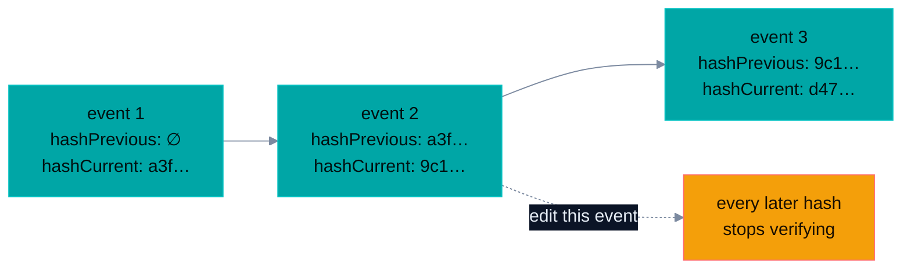

<h1 align="center">@smooai/audit</h1>

<p align="center">
  <a href="https://smoo.ai"></a>
  <a href="./LICENSE"></a>
  <a href="https://github.com/SmooAI/audit/actions/workflows/pr-checks.yml"></a>
</p>

<p align="center">
  <a href="https://www.npmjs.com/package/@smooai/audit"></a>
  <a href="https://pypi.org/project/smooai-audit/"></a>
  <a href="https://crates.io/crates/smooai-audit"></a>
  <a href="https://www.nuget.org/packages/SmooAI.Audit"></a>
  <a href="https://pkg.go.dev/github.com/SmooAI/audit/go"></a>
</p>

<p align="center">
  
  
  
</p>

<p align="center">
  <a href="#what-is-this"><b>What it is</b></a> &nbsp;·&nbsp; <a href="#feature-tour"><b>Feature tour</b></a> &nbsp;·&nbsp; <a href="#install"><b>Install</b></a> &nbsp;·&nbsp; <a href="#usage"><b>Usage</b></a> &nbsp;·&nbsp; <a href="#honest-per-language-status"><b>Per-language status</b></a> &nbsp;·&nbsp; <a href="#-part-of-smoo-ai"><b>Platform</b></a>
</p>

---

> **An audit log you can't quietly rewrite is worth more than one you can.** `@smooai/audit` chains every event into a per-org-per-day **SHA-256 hash chain**, serialized to **byte-identical canonical JSON in five languages** — so a hash computed by a Go service verifies against one computed in Rust, TypeScript, Python, or C#. That isn't a hope, it's a **tested guarantee**: all five implementations assert byte-for-byte against one shared parity corpus, and all five ship to their registries in version lockstep.

## What is this?

A polyglot **client SDK** for tamper-evident, SQL-queryable audit logging. Every service — in any language — gets one shared way to emit audit events that are:

- **Canonical** — a single `AuditEvent` schema, serialized to byte-identical canonical JSON regardless of language, so events are comparable and hashable everywhere.
- **Tamper-evident** — each event's hash covers the previous event's hash (per org, per day), so any retroactive edit or deletion breaks every subsequent link.
- **Trace-correlated** — the W3C trace context rides in the wire envelope, so an audit row joins back to the exact request that caused it.
- **SQL-queryable** — events land in a structured store you query with plain SQL.

Native in **TypeScript · Python · Rust · Go · .NET**, with identical semantics — see the [honest per-language status](#honest-per-language-status) for the few places the surfaces still differ.

## Feature tour

|     | Capability                                                    | What you get                                                                     |
| --- | ------------------------------------------------------------- | -------------------------------------------------------------------------------- |
| 🧬  | [**One corpus, five languages**](#-one-corpus-five-languages) | Byte-for-byte parity, asserted in every language's CI — not claimed, tested      |
| 🔗  | [**Tamper-evident hash chain**](#-tamper-evident-hash-chain)  | Per-org-per-day SHA-256 chain; edit one event, break every later link            |
| 🔎  | [**Trace correlation**](#-trace-correlation-outside-the-hash) | `traceId`/`spanId` on the envelope — never inside the hashed event               |
| 📦  | [**Version-lockstep releases**](#install)                     | v0.2.0 on npm, PyPI, crates.io, NuGet, and the Go module — same commit, same tag |

### 🧬 One corpus, five languages

Audit trails are only trustworthy if a hash means the same thing everywhere. The canonical serializer and hash chain are held to a **shared parity corpus** — [`spec/parity-corpus.json`](./spec/parity-corpus.json), 8 fixtures, each a fixed input event with its expected canonical JSON and expected SHA-256:

```jsonc
{
  "name": "minimal_first_of_day",
  "event": { "id": "01HXXX…", "organizationId": "org-1", "actorType": "user" /* … */ },
  "expectedCanonical": "{\"action\":\"crm.contact_created\",\"actorId\":\"user-1\",…}",
  "expectedHash": "fda23a489aabc145eb0f0ab4c2c60c6df9c303053a8d18ab089f0bd8871c79ac",
}
```

**All five test suites load this exact file** ([TS](./src/parity-corpus.spec.ts) · [Python](./python/tests/test_audit.py) · [Rust](./rust/audit/tests/parity.rs) · [Go](./go/audit_test.go) · [.NET](./dotnet/tests/SmooAI.Audit.Tests/AuditTests.cs)) and assert byte-for-byte equality — so a chain written by a Go service verifies cleanly in a Rust or TypeScript reader. A divergence is a CI failure, not a production surprise.

The corpus has a second half, `chainFixtures`: 11 whole chains, sealed by the real builder and then genuinely tampered with — a mutated field, a backdated timestamp, a reordered pair, a rewritten `hashPrevious`, a deleted middle event, a truncated head. Each carries the verdict every language must return (`ok`, `brokenAt`, and a shared failure code), so all five prove they **detect** tampering, not merely that they can hash. Sealing parity without detection parity is how a library ends up tamper-evident in one language and tamper-_oblivious_ in four.

### 🔗 Tamper-evident hash chain

Each event's `hashCurrent` is `SHA-256(canonical-JSON(event minus hashCurrent))`, and every event carries `hashPrevious` — the prior event's hash in the per-org-per-day chain. Rewrite or delete any event and every subsequent hash stops verifying.



Verification replays the chain: recompute every hash and confirm each `hashPrevious` matches the prior `hashCurrent`. A ready-made verifier ships in **all five languages** — `verifyChain` (TS) · `verify_chain` (Python, Rust) · `VerifyChain` (Go) · `HashChain.Verify` (.NET) — and each returns the same verdict: `ok`, the index of the first broken link, and a shared failure code (`hash_previous_mismatch` when the LINK is wrong, `hash_current_mismatch` when the event BODY was edited after sealing). Pass the chain head you already hold when verifying a slice that continues an existing chain rather than one starting at the beginning of the org's day.

> **What replay cannot see.** Deleting events from the **tail** of a chain leaves something that still verifies — every remaining link is genuine. Catching that needs an external anchor (a stored chain head, an expected count) compared against the last event's `hashCurrent`. `ok` means _nothing here was altered_, not _nothing is missing_. The corpus pins this as an explicit fixture (`truncated_chain_tail_removed`, expected `ok: true`) so the limit stays visible instead of being mistaken for coverage.

### 🔎 Trace correlation, outside the hash

`emit` POSTs the canonical JSON of an **envelope**, not the bare event:

```json
{
  "event": { "…the sealed event…": "…" },
  "spanId": "00f067aa0ba902b7",
  "traceId": "4bf92f3577b34da6a3ce929d0e0e4736"
}
```

`traceId` / `spanId` are the W3C trace context captured at emit time, so an audit row can be joined back to the request that caused it. They live in the envelope, one level **above** the event, and never inside it: the hash chain covers canonical-JSON(event minus `hashCurrent`), so a field added to the event would change every hash and invalidate every chain already in a store. The bytes under `"event"` are byte-identical with or without a trace active — every language asserts the parity corpus inside an active span as well as outside one.

Both ids are omitted entirely when there is no valid span — never an empty string, never the all-zero id an unregistered SDK hands you. OpenTelemetry is optional everywhere: TypeScript (optional `@opentelemetry/api` peer dep) · Rust (`otel` cargo feature, off by default) · Python (`pip install smooai-audit[otel]`, guarded import) · Go (trace API only, no SDK — reads the span off the `ctx` you already pass) · .NET (`Activity.Current` from the BCL, no new package at all).

## The shared surface

Every language exposes the same four things:

| Concept                                              | What it does                                                                                                                                                                                                                                                                                                                           |
| ---------------------------------------------------- | -------------------------------------------------------------------------------------------------------------------------------------------------------------------------------------------------------------------------------------------------------------------------------------------------------------------------------------- |
| `AuditEvent`                                         | The canonical event schema — `id`, `organizationId`, `actorType`, `actorId`, `action`, `resource {type, id}`, `outcome`, `metadata`, `timestamp`, plus optional context (`actorEmail`, `reason`, `sessionId`, `conversationId`, `ipAddress`, `userAgent`, `geoCountry`, `diff`) and the chain fields `hashPrevious?` / `hashCurrent?`. |
| `canonicalJson(event)`                               | Deterministic, byte-identical JSON serialization.                                                                                                                                                                                                                                                                                      |
| `computeEventHash(event)` / `buildHashChain(events)` | The per-org-per-day SHA-256 hash chain (`HashChain.ComputeEventHash` / `HashChain.Build` in .NET).                                                                                                                                                                                                                                     |
| `verifyChain(events, genesisPreviousHash?)`          | Replays the chain and reports the first broken link (`HashChain.Verify` in .NET).                                                                                                                                                                                                                                                      |
| `AuditClient` / `emit(event)`                        | Seals the event (stamps `hashCurrent`) and POSTs the canonical envelope to a configurable ingest endpoint with a bearer token.                                                                                                                                                                                                         |

## Install

All five packages release in **version lockstep** — v0.2.0 everywhere, cut from the same commit:

| Language   | Package                                                                       | Install                                               |
| ---------- | ----------------------------------------------------------------------------- | ----------------------------------------------------- |
| TypeScript | [`@smooai/audit`](https://www.npmjs.com/package/@smooai/audit)                | `pnpm add @smooai/audit`                              |
| Python     | [`smooai-audit`](https://pypi.org/project/smooai-audit/)                      | `uv add smooai-audit` (or `pip install smooai-audit`) |
| Rust       | [`smooai-audit`](https://crates.io/crates/smooai-audit)                       | `cargo add smooai-audit`                              |
| Go         | [`github.com/SmooAI/audit/go`](https://pkg.go.dev/github.com/SmooAI/audit/go) | `go get github.com/SmooAI/audit/go`                   |
| .NET       | [`SmooAI.Audit`](https://www.nuget.org/packages/SmooAI.Audit)                 | `dotnet add package SmooAI.Audit`                     |

## Usage

**TypeScript** — full shape; the other languages mirror it.

```ts
import { AuditClient, type AuditEvent } from "@smooai/audit";

const client = new AuditClient({
  endpoint: process.env.AUDIT_ENDPOINT!,
  token: process.env.AUDIT_TOKEN!,
});

await client.emit({
  id: "01HXXXXXXXXXXXXXXXXXXXXXXX", // ULID-like sortable id
  organizationId: "org_123",
  actorType: "user",
  actorId: "user_abc",
  action: "crm.contact_deleted",
  resource: { type: "crm.contact", id: "c-42" },
  outcome: "success",
  metadata: { reason: "gdpr" },
  timestamp: new Date().toISOString(),
});
```

**Python** — snake_case construction, camelCase on the wire (pydantic aliases):

```python
from smooai_audit import AuditClient, AuditClientOptions, AuditEvent, AuditResource

client = AuditClient(AuditClientOptions(endpoint=endpoint, token=token))
client.emit(AuditEvent(
    id="01HXXXXXXXXXXXXXXXXXXXXXXX", organization_id="org_123",
    actor_type="user", actor_id="user_abc", action="crm.contact_deleted",
    resource=AuditResource(type="crm.contact", id="c-42"),
    outcome="success", metadata={}, timestamp="2026-08-20T12:00:00.000Z",
))
```

**Rust**

```rust
use smooai_audit::{AuditClient, AuditClientOptions};

let client = AuditClient::new(AuditClientOptions { endpoint, token });
client.emit(&event).await?; // or emit_with_trace(&event, Some(trace))
```

**Go**

```go
import audit "github.com/SmooAI/audit/go"

client := audit.NewClient(endpoint, token)
err := client.Emit(ctx, event) // trace context read from ctx
```

**.NET**

```csharp
using System.Text.Json.Nodes;
using SmooAI.Audit;

var client = new AuditClient(new AuditClientOptions { Endpoint = endpoint, Token = token });
await client.EmitAsync(new AuditEvent
{
    Id = "01HXXXXXXXXXXXXXXXXXXXXXXX", OrganizationId = "org_123",
    ActorType = "user", ActorId = "user_abc", Action = "crm.contact_deleted",
    Resource = new AuditResource { Type = "crm.contact", Id = "c-42" },
    Outcome = "success", Metadata = new JsonObject(),
    Timestamp = DateTimeOffset.UtcNow.ToString("O"),
});
```

## Honest per-language status

The core contract — canonical JSON, the hash chain, the emit envelope, trace correlation — is **complete and parity-tested in all five languages**. The surfaces around it are not yet symmetric, and you should know exactly where:

| Capability                                                      |        TS        |       Python       |        Rust        |        Go        |        .NET        |
| --------------------------------------------------------------- | :--------------: | :----------------: | :----------------: | :--------------: | :----------------: |
| Canonical JSON + hash chain (parity-corpus-verified)            |        ✅        |         ✅         |         ✅         |        ✅        |         ✅         |
| Envelope trace correlation (optional OTel)                      |        ✅        |         ✅         |         ✅         |        ✅        |         ✅         |
| `emit` client                                                   |     ✅ async     |      ✅ sync       |      ✅ async      |  ✅ sync (ctx)   |      ✅ async      |
| Retry with backoff on transient emit failure                    |        ✅        |         —          |         —          |        —         |         —          |
| Chain verification (corpus-verified against 11 tampered chains) |        ✅        |         ✅         |         ✅         |        ✅        |         ✅         |
| Chain builder name                                              | `buildHashChain` | `build_hash_chain` | `build_hash_chain` | `BuildHashChain` | `HashChain.Build`  |
| Chain verifier name                                             |  `verifyChain`   |   `verify_chain`   |   `verify_chain`   |  `VerifyChain`   | `HashChain.Verify` |

Error posture also differs by design: the TypeScript, Rust, Go, and .NET clients surface emit failures to the caller; the **Python client swallows transport errors by default** (audit emission should not take down the request path) — set `swallow_errors=False` or pass an `on_error` hook to change that.

## Development

One repo, five implementations, one CI job that runs them all ([`pr-checks.yml`](./.github/workflows/pr-checks.yml)). See [`CLAUDE.md`](./CLAUDE.md) / [`AGENTS.md`](./AGENTS.md) for the full command set. The short version:

```bash
pnpm install
pnpm check-all   # typecheck + lint + test + build across all languages
```

Parity is the contract: any change to `canonicalJson` or the hash chain must update [`spec/parity-corpus.json`](./spec/parity-corpus.json) and pass in **all five** languages — a canonical/hash change in one language is a breaking, cross-language change. The `chainFixtures` half is generated, never hand-written: `pnpm tsdown && node scripts/gen-chain-fixtures.mjs`. A hand-typed expected hash is a hash nobody computed.

## 🧩 Part of Smoo AI

`@smooai/audit` is built and open-sourced by **[Smoo AI](https://smoo.ai)** — the AI-powered business platform with AI built into every product: CRM, customer support, campaigns, field service, observability, and developer tools.

- 🧰 **More open source from Smoo AI** — [smoo.ai/open-source](https://smoo.ai/open-source)
- 🧩 **Sibling packages** — [@smooai/config](https://github.com/SmooAI/config) (typed config/secrets/flags, 7 languages), [smooth-operator](https://github.com/SmooAI/smooth-operator) (the polyglot AI agent service), [smooth](https://github.com/SmooAI/smooth) (the `th` CLI)

## 🤝 Contributing

Issues and PRs welcome. Add a changeset for SDK changes, and call out any change to canonical/hash behavior in bold — it's a breaking, cross-language change.

## 📄 License

[MIT](./LICENSE) © SmooAI

---

<p align="center">
  Built by <a href="https://smoo.ai"><strong>Smoo AI</strong></a> — AI built into every product.
</p>
